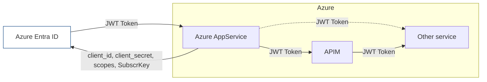
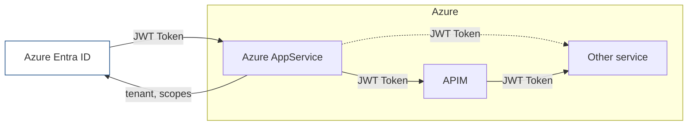

# Accessing other services and APIs in Azure

## Access an API via sytem user and AppRegistration tokens

### Generating tokens with a client secret

### Generating tokens with

There is a slighty different option to use tokens - even without storing the client secret in the connection configuration.
This requires Azure Managed Identities to be attached to all participating azure services

## Access API as a human user via OAuth

The AppService needs to get a token to access a foreign server using the existing OAuth token of the currently logged
in users. The AppService will call the other service "on behalf" of the logged on user.