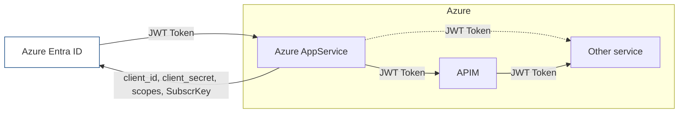
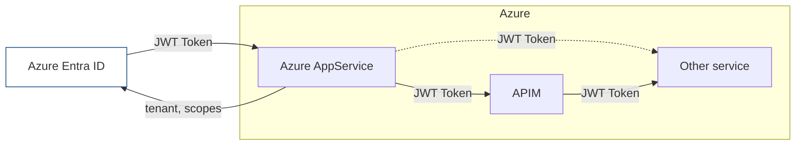
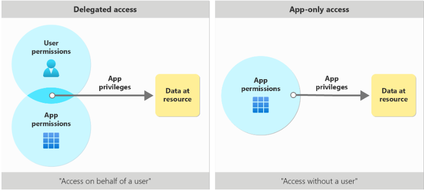

# Accessing other services and APIs in Azure

## Access an API via sytem user and AppRegistration tokens

### Generating tokens with a client secret


```mermaid
flowchart LR
    EntraID[Azure Entra ID]
    APIM[APIM]
    AppService[Azure AppService]
    FunctionApp[Other service]
    
    AppService -->|client_id, client_secret, scopes, SubscrKey| EntraID
    EntraID -->|JWT Token| AppService

    subgraph Azure
        AppService -.->|JWT Token| FunctionApp
        AppService -->|JWT Token| APIM
        APIM -->|JWT Token| FunctionApp
    end
    
    style EntraID fill:#FFF,stroke:#104581
```

### Generating tokens with

There is a slighty different option to use tokens - even without storing the client secret in the connection configuration.
This requires Azure Managed Identities to be attached to all participating azure services


```mermaid
flowchart LR
    EntraID[Azure Entra ID]
    APIM[APIM]
    AppService[Azure AppService]
    FunctionApp[Other service]
    
    AppService -->|tenant, scopes| EntraID
    EntraID -->|JWT Token| AppService

    subgraph Azure
        AppService -.->|JWT Token| FunctionApp
        AppService -->|JWT Token| APIM
        APIM -->|JWT Token| FunctionApp
    end
    
    style EntraID fill:#FFF,stroke:#104581
```

## Authentication and authorization basics
AppService can access data in one of two ways as illustrated in the following image.

 * Delegated access, an app acting on behalf of a signed-in user.
 * App-only access, an app acting with its own identity.



### Delegated access (access on behalf of a user)
The AppService needs to get a token to access a foreign server using the existing OAuth token of the currently logged
in users. The AppService will call the other service "on behalf" of the logged on user.

#### Connection example:
```
 "authentication": {
     "class": "\\axenox\\Microsoft365Connector\\CommonLogic\\Security\\Authenticators\\MicrosoftOAuth2Autenticator",
     "id": "AZURE_AD",
     "name": "Azure AD",
     "client_id": "...",
     "client_secret": "...",
     "tenant": "...",
     "scopes": [
            "Group.Read.All",
            "User.Read",
            "openid",
            "profile",
            "email"
          ],
 }
```
The `scopes` are the permissions that the user/app needs to access the API. 
They need to be set in Azure too. You can read more about scopes in [Single-Sign-On with Microsoft Azure via OAuth 2.0](Single-Sign-On_with_Azure_via_OAuth.md).

### App-only access (Access without a user)
In this access scenario, the application acts on its own with no user signed in. 
Application access is used in scenarios such as automation and backup.

Connection example:
```
  "authentication": {
    "class": "\\axenox\\Microsoft365Connector\\DataConnectors\\Authentication\\AzureAppRegistrationAuth",
    "client_id": "...",
    "client_secret": ".",
    "tenant": "...",
    "scope": "api://.../.default"
  },
```
The `scope` is build of the `client_id` of the app that we are trying to access and the suffix `/.default`.
"default" means, that the app will get all permissions that are assigned to it in Azure. 
This is a special scope for app-only access that fetches all app roles and is not used for delegated access.

App-only access uses app roles instead of delegated scopes. 
When granted through consent, app roles might also be called applications permissions. 
The client app must be granted appropriate application permissions of the resource app it's calling. 
Once granted, the client app can access the requested data. 
For more information about assigning app roles to client applications, see [official Azure documentation](https://learn.microsoft.com/en-us/entra/identity-platform/howto-add-app-roles-in-apps#assign-app-roles-to-applications).

### App-only access to Microsoft Graph API
Microsoft Graph API has the `client_id` = `00000003-0000-0000-c000-000000000000`. 
So the scope for app-only access to Microsoft Graph would be `api://00000003-0000-0000-c000-000000000000/.default`.
Or the more human-readable version can also be used: `https://graph.microsoft.com/.default` .

---
For more information about the authentication and authorization basics see the [Overview of permissions and consent in the Microsoft identity platform](https://learn.microsoft.com/en-us/entra/identity-platform/permissions-consent-overview#consent).