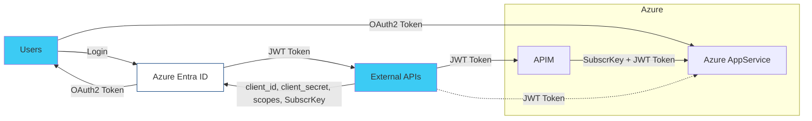
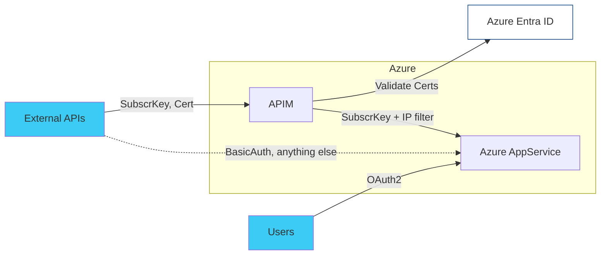

# Authenticating APIs in Azure

## Authentication via AppRegistration tokens

## Authentication via TLS certificates

The APIM supports mutual TLS authentication. It can validate provided certificats, but does not pass those further to
the AppService. This makes it difficult to securely identifiy APIM requests and those from "outside". It also requires
a simplified authentication for APIM requests just via subscription key. But since we can't identify APIM requests, we
are forced to allow subscription key authentication for ALL requests.

