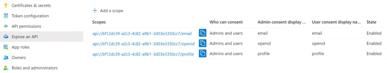

# Single-Sign-On with Microsoft Azure via OAuth 2.0

To enable Single-Sign-On with Microsoft Azure via OAuth 2.0, you need to register the workbench installation (URL) as an "Application" in Azure Active Directory:

1. Go to https://portal.azure.com/
2. Select Azure Active Directory
3. Proceed to "App registrations" in the menu
4. Create a new registration or select an existing one

You will need to provide a redirect URL: `https://yourdomain.com/path_to_workbench/api/oauth2client`. Make sure you use a secure HTTPS URL with a valid SSL certificate! For testing purposes you can use `http://localhost/path_to_workbench/api/oauth2client`.

You will also need to think about the required scopes. These are set in the configuration of the authenticator and are requested when performing SSO. You may need to white-flag them in Azure too. 



The default scopes used if not set explicitly are `openid`, `profile`, `email`.

After the app registration is complete, you will get the following information required to configure
the authenticator in `System.config.json`:

- `Application (client) ID` in Azure is your `client_id` in the config. It is visible in the "Essentials" 
section right at the top of the page if you click on the Azure app.
- `Directory (tenant) ID` in Azure is your `tenant` in the config. This can also be found in the "Essentials".
It may not be needed - this depends on the configuration of Azure AD. 
- `Secret key value` in Azure corresponds to `client_secret` in the config. Go to "Certificates and secrets" 
in the main menu inside the app registration and press `Add secret`. Once created, the secret will appear in
the table. You will need the value from the `Value` column. It will only be visible once, right after creation.
If you navigate away, you will need to create a new secret.

For more information see the [official Azure documentation](https://docs.microsoft.com/en-us/azure/active-directory/develop/active-directory-v2-protocols).

## Example Configuration

```
 {
     "class": "\\axenox\\Microsoft365Connector\\CommonLogic\\Security\\Authenticators\\MicrosoftOAuth2Autenticator",
     "id": "AZURE_AD",
     "name": "Azure AD",
     "client_id": "552b11b2-586d-4154-a67b-c57af5a7ccce",
     "client_secret": "fx2NG7jjy0JK8_8l.G-0lXup_T9F7W_iWm",
     "create_new_users": true,
     "create_new_users_with_roles": [
         "my.App.DefaultRole"
     ]
 }
```

## Troubleshooting

See [Troubleshooting](Troubleshooting.md).

## Synchronizing user roles with Azure groups

Single-sign-on basically means, that users are managed by Azure completely. The roles of these users are still defined within the workbench though. This means, that every new user will need some configuration in Azure (to be able to log in) and in the workbench administration too (to get specific roles for the apps).

It is possible to manage user roles in Azure too. See [synchronizing user roles with Azure groups](Synchronizing_roles_with_Azure_groups.md) for details.