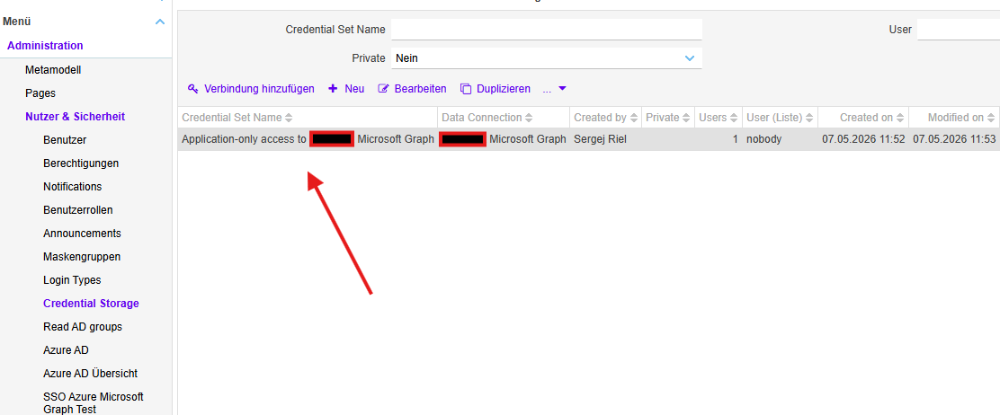
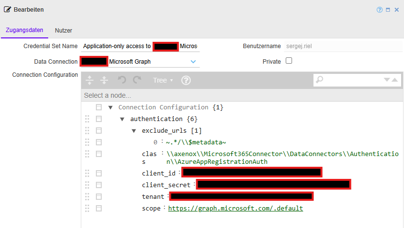
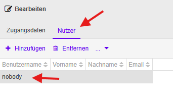
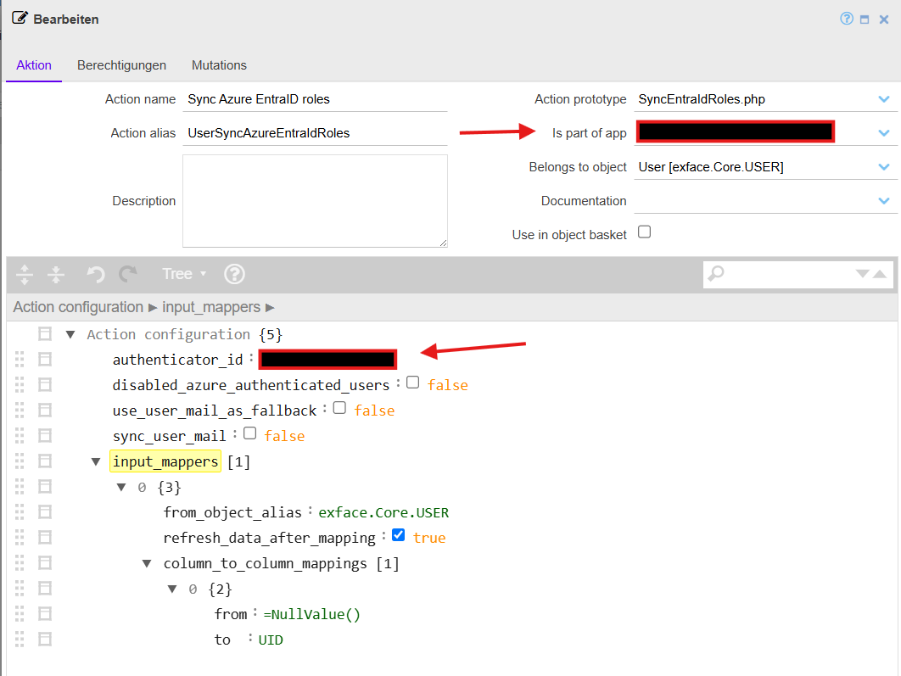
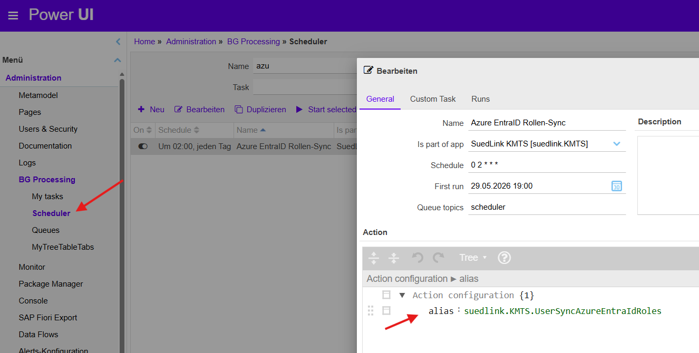
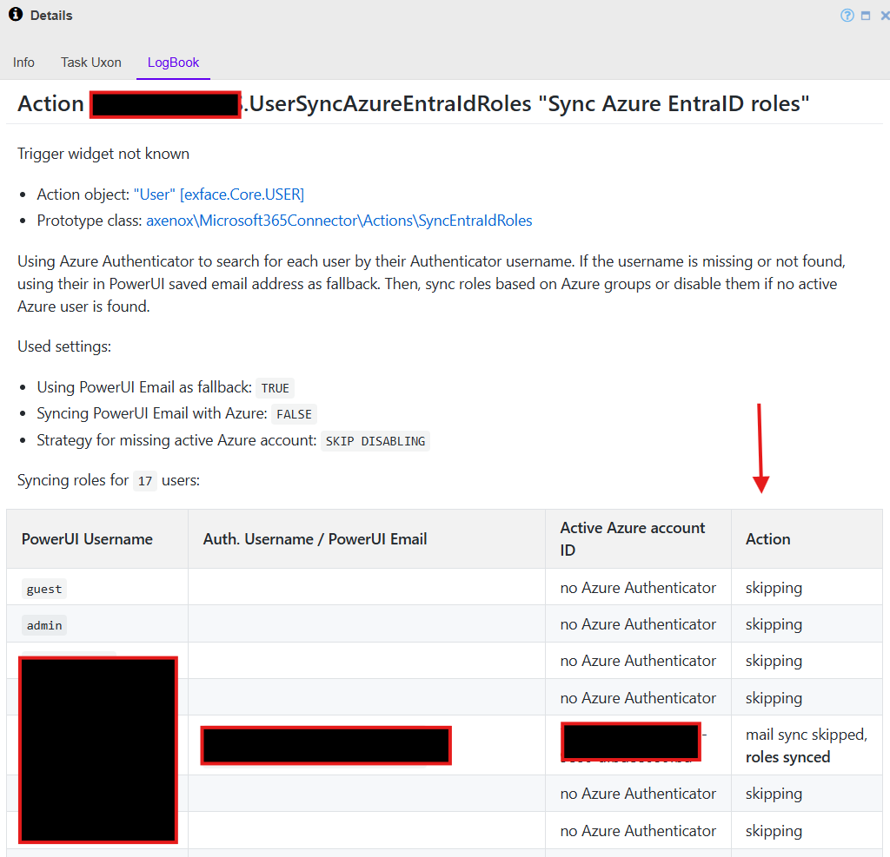

# Introduction
This document provides a step-by-step guide to setting up the SyncEntraIdRoles action for nightly background
synchronization of Entra ID roles and mails to PowerUI.
To learn more about the SyncEntraIdRoles action and the Microsoft Graph connection, please refer to the [SyncEntraIdRoles documentation](SyncEntraIdRoles_documentation.md).

# Requirements
To use this action, we need to configure the connection to the Microsoft Graph API inside PowerUI.

Our Action calls the Microsoft Graph API through the flowing objects:
- `axenox.Microsoft365Connector.users`
- `axenox.Microsoft365Connector.userGroups`

They both use the same `Microsoft Graph` data source, with is bound to a specific Custom Connection: `[ClientName] Microsoft Graph`.
This custom connection defines the "delegated access" access scenario to the Microsoft Graph API. So the call only works with an authorized user.
Read more about [different access scenarios here](https://github.com/axenox/Microsoft365Connector/blob/1.x-dev/Docs/Authentication_and_authorization_basics_with_Azure.md).

We need to configure the "app-only" access to Microsoft Graph API so the scheduler task can fetch the user data 
without a real user beeing logged in. The "app-only" access connection is differed from the "delegated access" connection 
and needs to be configured in the Credential Storage.

## Credential Storage
The connection configuration should be stored inside the corresponding Credential Storage:


Here you can define the "app-only" connection to the Microsoft Graph API with the following parameters:


**NOTE:**
the `Data Connection` should be set to Microsoft Graph, with data source is also used at the Object `axenox.Microsoft365Connector.users` and `axenox.Microsoft365Connector.userGroups`.

Template:
```
{
  "authentication": {
    "exclude_urls": [
      "~.*/\\$metadata~"
    ],
    "class": "\\axenox\\Microsoft365Connector\\DataConnectors\\Authentication\\AzureAppRegistrationAuth",
    "client_id": "...",
    "client_secret": "...",
    "tenant": "...",
    "scope": "https://graph.microsoft.com/.default"
  }
}

```

The `client_id`, `client_secret`, etc. are to be found in your app registration. You can use the same app registration
for single-sign-on and this app-only authentication. However, the app-only authentication requires a different
permission: `Directory.Read.All`. The permission `User.Read.All` is not enough here.

## User Tab
At the user Tab (Nutzer) you can link this credential storage to a user. 
This user should be a dummy user with "CLI User" role that will be used in scheduler tasks to run the background process.

You can also list real users here that should be able to execute the SyncEntraIdRoles action manually.



After the `Credential Storage` setting is done, PowerUI will automatically swap 
the Microsoft Graph `Data Connection` to the "app-only" access connection for defined users inside the User tab.

## Wrapper Action

At this moment, the scheduler can not pass properties to called actions, 
that is why we need to create a wrapper action for the SyncEntraIdRoles action. 
This wrapper action will be called by the scheduler and will call the original SyncEntraIdRoles action with the required properties.

Create a new wrapper action like the `UserSyncAzureEntraIdRoles` action that has "Action prototype": `SyncEntraIdRoles.php`.


Example:
```
{
  "authenticator_id": "MICROSOFT_O_AUTH",
  "disabled_azure_authenticated_users": false,
  "use_user_mail_as_fallback": false,
  "sync_user_mail": false,
  "input_mappers": [
    {
      "from_object_alias": "exface.Core.USER",
      "refresh_data_after_mapping": true,
      "column_to_column_mappings": [
        {
          "from": "=NullValue()",
          "to": "UID"
        }
      ]
    }
  ]
}
```

Set the `Is part of app` to the specific app and define the `authenticator_id` to the authenticator that is used for the Entra ID SSO login.
You can also set the optional properties:
- `disabled_azure_authenticated_users`: if set to true, the action will disable users that are not active or no longer present in Entra ID.
- `use_user_mail_as_fallback`: if set to true, the action will use the PowerUI user mail as fallback for finding the user in Graph if the user is not found by the `Authenticator username`.
- `sync_user_mail`: if set to true, the action will also sync the user mail from Entra ID to PowerUI. The Sync can be disabled for each user separately by setting the `Sync mail flag` at `User => Authentification => Edit`

**ATTENTION:** it is strongly recommended to set the `disabled_azure_authenticated_users` at the first run 
to `false` and check the results inside the logbook. If everything is working as expected, 
you can set it to true for the next run.

## Scheduler Task
Now we can create a scheduler task that will call the wrapper action:


## Logbook
The logbook will show the results of the SyncEntraIdRoles action. You can check the logbook logs at:

`Administration => BG Processing => Tasks (Select the entry with the " .UserSyncAzureEntraIdRoles" action alias) => "LogBook" Tab`



Here inside the "Action" column you can see the result of the sync for each user.