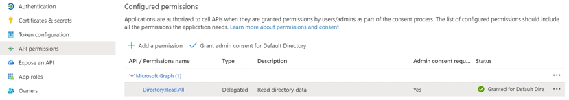

# Synchronizing user roles with Azure groups via Microsoft Graph API

If Azure groups cannot be [included in the OAuth token](Synchronizing_roles_via_OAuth2_token.md), there is an option to read them explicitly via the Microsoft Graph API, that is always available in Azure.

In this case, the Azure groups will be read via Microsoft Graph using the OAuth token provided by Azure during
initial authentication. To make this work, you need to tell the authenticator to share the token with the
connection to Microsoft Graph via `share_token_with_connections`.

To make this work, the Azure app registration must have the permission to read groups of a user:



In the workbench it is neccessary to configure the authenticator and a data connection for Microsoft Graph. The required meta objects for users and roles are already part of this app and do not need to be changed.

**IMPORTANT:** the configuration of the data connection for Microsoft Graph (client_id, secret, tenant, claims etc.)
MUST be identical with that of the authenticator!

```
 {
     "class": "\\axenox\\Microsoft365Connector\\CommonLogic\\Security\\Authenticators\\MicrosoftOAuth2Autenticator",
     "id": "AZURE_AD",
     "name": "Azure AD",
     "client_id": "552b11b2-586d-4154-a67b-c57af5a7ccce",
     "client_secret": "fx2NG7jjy0JK8_8l.G-0lXup_T9F7W_iWm",
     "tenant": "d79fb5c8-cd79-4b9e-857e-7c571213458",
     "claims": [
         "openid", 
         "profile", 
         "email",
         "User.Read",
         "Directory.Read.All"
     ],
     "create_new_users": true,
     "sync_roles_with_data_sheet": {
         "object_alias": "axenox.Microsoft365Connector.meGroups",
         "columns": [
             {
                 "attribute_alias": "displayName"
             }
         ]
     },
     "share_token_with_connections": [
         "my.App.ConnectionToMicrosoftGraph"
     ]
 }
```

Here is an example of a corresponding connection configuration. Copy the built-in MS Graph connection
and modify its configuration to match that of the authenticator. See [Graph data connection docs](Microsoft_Graph_as_data_source.md) for more details.

```
 {
     "url": "https://graph.microsoft.com/v1.0/",
     "authentication": {
         "class": "\\axenox\\Microsoft365Connector\\DataConnectors\\Authentication\\MicrosoftOAuth2",
         "client_id": "552b11b2-586d-4154-a67b-c57af5a7ccce",
         "client_secret": "fx2NG7jjy0JK8_8l.G-0lXup_T9F7W_iWm",
         "tenant": "d79fb5c8-cd79-4b9e-857e-7c571213458",
         "scopes": [
             "openid",
             "profile",
             "email",
             "User.Read",
             "Directory.Read.All"
         ]
     }
 }
```